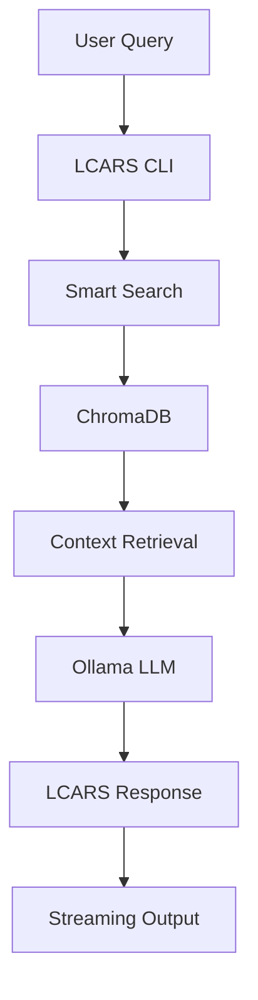

# Memory Alpha RAG System 🖖

A Star Trek Memory Alpha Retrieval Augmented Generation (RAG) system that provides an authentic LCARS (Library Computer Access and Retrieval System) interface for querying the complete Memory Alpha database using ChromaDB and Ollama.

## 🌟 Features

- **🖖 Authentic LCARS Interface**: Star Trek computer-themed chat experience
- **📚 Complete Memory Alpha Database**: 37,000+ articles from the Star Trek wiki
- **🔍 Smart Semantic Search**: Advanced query expansion and context retrieval
- **🤖 AI-Powered Responses**: Uses Ollama with configurable language models
- **🐳 Full Containerization**: Docker Compose setup with dev containers
- **⚡ Streaming Responses**: Real-time response generation
- **🎯 Preserves Technical Details**: Maintains starship names, registry numbers, and specifications

## 🚀 Quick Start with Dev Container

### Prerequisites

- [Docker](https://www.docker.com/get-started) and Docker Compose
- [VS Code](https://code.visualstudio.com/) with [Dev Containers extension](https://marketplace.visualstudio.com/items?itemName=ms-vscode-remote.remote-containers)

### 1. Open in Dev Container

1. Clone this repository:
   ```bash
   git clone https://github.com/aniongithub/memoryalpha_rag.git
   cd memoryalpha_rag
   ```

2. Open in VS Code:
   ```bash
   code .
   ```

3. When prompted, click **"Reopen in Container"** or:
   - Press `Ctrl+Shift+P` (Cmd+Shift+P on Mac)
   - Type "Dev Containers: Reopen in Container"
   - Press Enter

### 2. Setup the Database

The dev container will automatically start Ollama. Now set up the Memory Alpha database:

```bash
# Run the data pipeline to download and process Memory Alpha
./data-pipeline-docker.sh
```

This will:
- Download the Memory Alpha XML dump (~500MB)
- Extract and clean 37,000+ articles
- Create a ChromaDB vector database
- Compress the database for distribution

**Note**: This process takes 10-20 minutes depending on your hardware.

### 3. Start Chatting

Once the database is ready, start the LCARS interface:

```bash
python3 lcars/cli.py
```

You'll see the LCARS interface:
```
============================================================
🖖 LIBRARY COMPUTER ACCESS AND RETRIEVAL SYSTEM
   Memory Alpha Database Interface
============================================================
LCARS Ready. State your inquiry or type 'quit' to exit.

👤 QUERY: 
```

### 4. Example Queries

Try these queries to test the system:

```
Who is Captain Picard?
What is the USS Enterprise?
Tell me about Data
What is the Prime Directive?
Who created warp drive?
```

## 🐳 Docker Compose Usage (Alternative)

If you prefer using Docker Compose directly without VS Code:

```bash
# Start all services
docker-compose up -d

# Check Ollama is ready
curl http://localhost:11434/api/tags

# Enter the LCARS container
docker exec -it lcars bash

# Run the chat interface
python3 lcars/cli.py
```

## 📖 Detailed Usage

### Interactive Chat Mode

Start an interactive conversation with the LCARS computer:

```bash
python3 lcars/cli.py
```

**Chat Commands:**
- Type your Star Trek questions naturally
- Use `quit`, `exit`, `q`, `end program`, or `computer off` to exit
- Press `Ctrl+C` for emergency exit

### Single Question Mode

Ask a single question and exit:

```bash
python3 lcars/cli.py --question "Who is Captain Kirk?"
# or
python3 lcars/cli.py -q "What is the Prime Directive?"
```

### Command Line Options

```bash
python3 lcars/cli.py [OPTIONS]

Options:
  --chroma-db PATH     Path to ChromaDB database (default: /data/enmemoryalpha_db)
  --ollama-url URL     Ollama API URL (default: http://ollama:11434)  
  --model MODEL        Ollama model to use (default: qwen2:0.5b)
  --question TEXT      Ask a single question and exit
  -q TEXT              Short form of --question
  --help               Show help message
```

### Advanced Examples

```bash
# Use a different model (must be available in Ollama)
python3 lcars/cli.py --model "llama3.2:3b"

# Use local Ollama instance
python3 lcars/cli.py --ollama-url "http://localhost:11434"

# Use custom database path
python3 lcars/cli.py --chroma-db "/path/to/custom/db"

# Batch questions
echo "Who is Data?" | python3 lcars/cli.py
```

## 🔧 Development

### Dev Container Features

The dev container includes:
- **Python 3.12** with all dependencies pre-installed
- **VS Code Python extension** for debugging and IntelliSense
- **Debug configuration** for the LCARS CLI (`F5` to debug)
- **Automatic Ollama readiness checking**
- **Port forwarding** for Ollama (11434) and API (8000)

### Project Structure

```
memoryalpha_rag/
├── .devcontainer/          # VS Code dev container configuration
│   └── devcontainer.json
├── .vscode/               # VS Code settings and launch configs
│   └── launch.json
├── lcars/                 # Main LCARS application
│   └── cli.py            # LCARS chat interface
├── pipeline/              # Data processing pipeline
│   ├── 00-download-memory-alpha    # Download Memory Alpha dump
│   ├── 05-install-packages         # Install Python dependencies  
│   ├── 10-extract-memoryalpha-data # Parse and create ChromaDB
│   ├── 20-compress-memoryalpha-db  # Compress database
│   ├── pipeline-requirements.txt   # Pipeline dependencies
│   └── pipeline.Dockerfile         # Pipeline container
├── ollama/                # Ollama service configuration
│   ├── ollama.Dockerfile  # Custom Ollama container
│   └── bootstrap.sh       # Ollama startup script
├── data/                  # Data directory (gitignored)
│   ├── enmemoryalpha_pages_current.xml    # Raw Memory Alpha dump
│   ├── enmemoryalpha_db/                  # ChromaDB database
│   └── enmemoryalpha_db.tar.gz           # Compressed database
├── docker-compose.yml     # Multi-service Docker setup
├── Dockerfile            # Main application container
├── requirements.txt      # Python dependencies
├── data-pipeline-docker.sh # Pipeline execution script
├── wait-for-ollama.sh    # Ollama readiness check
└── README.md             # This file
```

### Debugging

1. **VS Code Debugging**: Press `F5` to start debugging the LCARS CLI with breakpoints
2. **Container Logs**: 
   ```bash
   docker-compose logs ollama    # Ollama logs
   docker-compose logs lcars     # LCARS logs
   ```
3. **Manual Testing**:
   ```bash
   # Test Ollama directly
   curl http://ollama:11434/api/generate \
     -d '{"model":"qwen2:0.5b","prompt":"Hello","stream":false}'
   
   # Test ChromaDB
   python3 -c "import chromadb; print('ChromaDB OK')"
   ```

## 🛠️ Customization

### Using Different Models

The system supports any Ollama-compatible models. To change the model globally, edit `.env` and set `DEFAULT_MODEL` to the desired ollama model tag. Remember to rebuild the devcontainer after doing this.

You can also use the terminal to change the model without rebuilding the container with:

```bash
# List available models
curl http://ollama:11434/api/tags

# Pull a new model
docker exec ollama ollama pull llama3.2:3b

# Use the new model
python3 lcars/cli.py --model "llama3.2:3b"
```

**Recommended Models:**
- `qwen2:0.5b` - Fast, lightweight (default)
- `llama3.2:3b` - Better quality, moderate size
- `llama3.1:8b` - High quality, larger size
- `gemma2:9b` - Alternative high-quality option

### Modifying the LCARS Prompt

Edit the system prompt in `lcars/cli.py` around line 125 to customize the LCARS personality:

```python
system_prompt = """You are the LCARS (Library Computer Access and Retrieval System) from Star Trek.
[Customize the personality and behavior here]
"""
```

### Database Customization

Modify pipeline settings in `pipeline/10-extract-memoryalpha-data`:

```python
MAX_PAGES = 1000  # Limit for testing (set to -1 for full database)
BATCH_SIZE = 50   # Adjust batch size for memory constraints
```

## 🔧 Troubleshooting

### Common Issues

#### "Model not found" Error
```bash
# Check available models
curl http://ollama:11434/api/tags

# Pull the required model
docker exec ollama ollama pull qwen2:0.5b
```

#### "Database not found" Error
```bash
# Verify database exists
ls -la data/enmemoryalpha_db/

# Recreate database if needed
./data-pipeline-docker.sh
```

#### Ollama Connection Issues
```bash
# Check Ollama status
curl http://ollama:11434/api/tags

# Restart Ollama service
docker-compose restart ollama

# Check logs
docker-compose logs ollama
```

#### Container Permission Issues
```bash
# Fix data directory permissions
sudo chown -R $USER:$USER data/

# Rebuild containers
docker-compose down
docker-compose up --build
```

### Performance Tuning

#### Memory Usage
- **ChromaDB**: Uses ~2GB RAM for full Memory Alpha database
- **Ollama**: Varies by model (0.5b: ~1GB, 3b: ~4GB, 8b: ~8GB)
- **Pipeline**: Peak ~4GB during database creation

#### Speed Optimization
```bash
# Use smaller model for faster responses
python3 lcars/cli.py --model "qwen2:0.5b"

# Reduce search results for faster retrieval
# Edit n_results in smart_search() function

# Use SSD storage for better ChromaDB performance
```

## 📚 How It Works

### Architecture



### RAG Pipeline

1. **Query Processing**: User input is processed and expanded with Star Trek-specific patterns
2. **Semantic Search**: ChromaDB finds relevant Memory Alpha articles using vector similarity
3. **Context Building**: Top articles are selected and formatted for the AI model
4. **Response Generation**: Ollama generates LCARS-styled responses using the context
5. **Streaming**: Response is streamed back to the user in real-time

### Data Processing

1. **Download**: Memory Alpha XML dump from Wikia (~500MB)
2. **Parsing**: MediaWiki markup is parsed and cleaned using mwparserfromhell
3. **Filtering**: Removes redirects, talk pages, and short articles
4. **Vectorization**: ChromaDB creates embeddings for semantic search
5. **Storage**: Persistent vector database with metadata

## 🤝 Contributing

1. **Fork the repository**
2. **Open in dev container** for consistent environment
3. **Make your changes**
4. **Test thoroughly** with various Star Trek queries
5. **Submit a pull request**

### Development Guidelines

- Follow existing code style and patterns
- Test with multiple models and query types
- Ensure LCARS personality remains authentic
- Update documentation for new features
- Preserve technical accuracy for Star Trek details

## 📄 License

This project is licensed under the [MIT License](LICENSE).

## 🙏 Acknowledgments

- **Memory Alpha** - The Star Trek wiki providing the comprehensive database
- **Ollama** - Local LLM inference engine
- **ChromaDB** - Vector database for semantic search
- **Wikia/Fandom** - Hosting the Memory Alpha XML dumps
- **Star Trek** - Gene Roddenberry's vision that inspired this project

## 🔗 Related Projects

- [Memory Alpha](https://memory-alpha.fandom.com/) - The Star Trek wiki
- [Ollama](https://ollama.ai/) - Run LLMs locally
- [ChromaDB](https://www.trychroma.com/) - AI-native database

---

**Live long and prosper!** 🖖

*"The accumulation of all wisdom is responsibility." - LCARS Computer*
